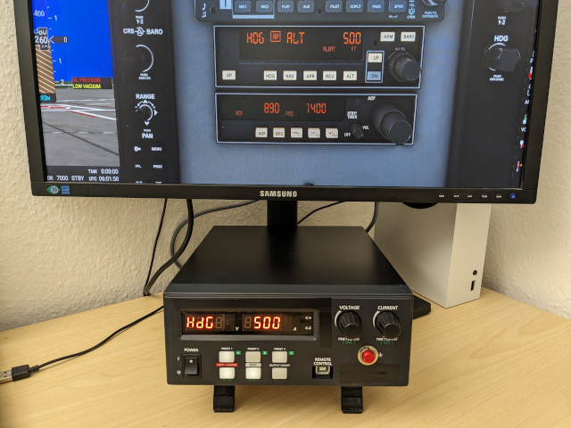

# HID-FCU

## About

HID-FCU is an autopilot control unit for use with Microsoft Flight
Simulator based on the [Bendix/King KAP
140](https://www.bendixking.com/content/dam/bendixking/en/documents/document-lists/downloads-and-manuals/006-18034-0000-KAP-140-Pilots-Guide.pdf)
autopilot system used in many aircraft such as the Pilatus PC-6
Turbo-Porter.

Since the unit, as already implied by the title, is detected as a Human
Interface Device (HID), it can be used both on the PC and on the Xbox.

The hardware is based on an STM32F103 microcontroller and the case of a
defective laboratory power supply.

## Licence

To the extent possible under law, Michael Fitzmayer has waived all
copyright and related or neighboring rights to HID-FCU.

[TM1637 Display driver for STM32](https://github.com/nimaltd/tm1637) is
licensed under the "GNU General Public License v3.0".  See the file
[LICENSE](https://raw.githubusercontent.com/nimaltd/tm1637/main/LICENSE)
for details.
